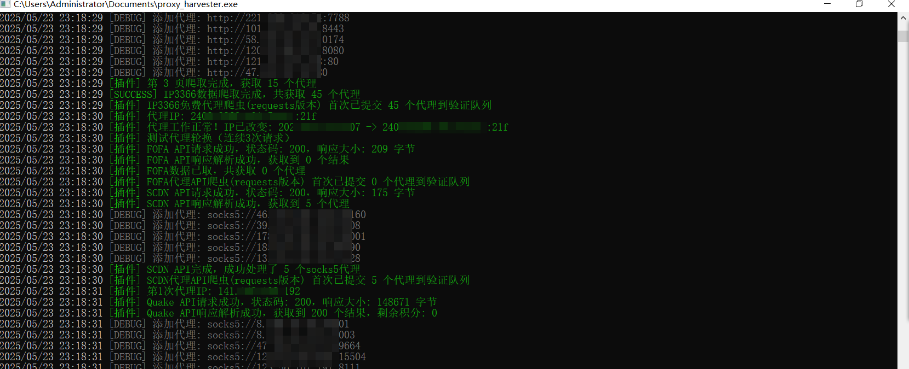
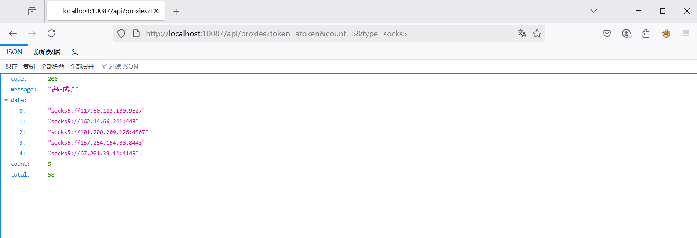
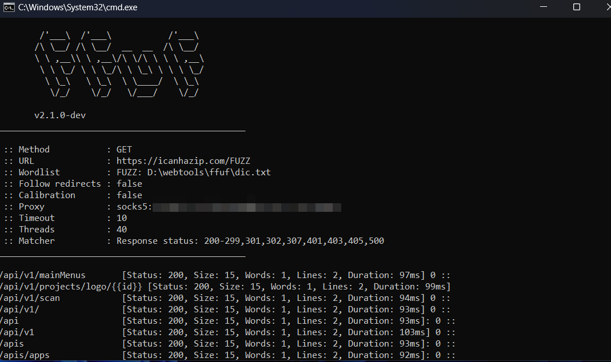

# 🚀 Proxy Harvester - 智能代理收集器

<div align="center">

[](https://golang.org/)
[](LICENSE)
[](https://github.com/overflow0verture/proxy_harvester)
[](https://github.com/overflow0verture/proxy_harvester)
[](https://github.com/overflow0verture/proxy_harvester)

**多源、智能的代理服务器收集与管理平台**

[🚀 快速开始](#-快速开始) | [📖 文档](#-功能特性) | [🔌 插件](#-插件系统) | [🌟 API](#-api-接口) 

---

*为开发者、安全工作者提供多源、高效的代理池解决方案*

</div>

## 📋 目录

- [🎯 项目简介](#-项目简介)
- [✨ 功能特性](#-功能特性)
- [🚀 快速开始](#-快速开始)
- [🔌 插件系统](#-插件系统)
- [🌟 API 接口](#-api-接口)
- [🤝 贡献指南](#-贡献指南)
- [📄 许可证](#-许可证)
- [🚀 参考项目](#-参考项目)
- [⚠️ 免责声明](#-免责声明)

## 🎯 项目简介

**Proxy Harvester** 是一个用 Go 语言开发的高性能代理服务器收集与管理平台。它支持从多个数据源自动收集 HTTP、HTTPS、SOCKS5 代理，并提供 API 接口供应用程序使用。

### 🎯 适用场景

- **Web 爬虫** - 为爬虫提供大量可用代理IP
- **数据采集** - 轮换ip，提高采集成功率 
- **API 集成** - 为第三方应用提供代理服务

## ✨ 功能特性

### 🔥 核心功能

| 功能 | 描述 | 状态 |
|------|------|------|
| **多源收集** | 支持网络空间引擎、免费ip网站等多个数据源 | ✅ |
| **智能验证** | 自动检测代理可用性 | ✅ |
| **类型支持** | HTTP/HTTPS/SOCKS5 | ✅ |
| **IP轮换** | 对检验可用的ip进行轮换代理 | ✅ |
| **API** | 标准化的API接口，支持多种查询方式 | ✅ |
| **插件架构** | 基于yaegi的动态插件系统，易于扩展（go源码插件方便更改） | ✅ |
| **定时任务** | Cron表达式支持，自动定时收集 | ✅ |


## 🚀 快速开始


### 📦 安装部署

#### 方式一：源码编译

```bash
# 克隆仓库
git clone https://github.com/overflow0verture/proxy_harvester.git
cd proxy_harvester

# 安装依赖
go mod tidy

# 编译程序
cd cmd/proxy_harvester
go build -ldflags "-w -s" -trimpath

# 运行程序
./proxy_harvester
```


#### 方式二：预编译二进制

https://github.com/overflow0verture/proxy_harvester/releases/tag/v1.0.0

### ⚡ 快速体验

configs目录下存放项目配置，在使用前请阅读基础配置

plugin目录下存放着插件，网络空间引擎需要对应的api-key，启动服务后，轮换代理端口默认10086，web api接口默认10087

修改完config.toml直接运行即可

```bash
curl -x socks5://127.0.0.1:10086 https://icanhazip.com/

curl http://127.0.0.1:10087/api/proxies?token=atoken&count=5&type=socks5
```
## 🔌 插件系统

### 🎯 插件架构

Proxy Harvester 采用基于 [yaegi](https://github.com/traefik/yaegi) 的动态插件系统，支持运行时加载和热更新，使用时将需要的插件下载后，直接加入plugins路径即可。

### 🧩 插件介绍

#### 网络空间引擎

|名称|插件路径|网站|备注|
|------|------|-------|------|
|hunter|[hunter_requests.go](plugins/hunter_requests.go)|[地址](https://hunter.qianxin.com/)|每日/月免费积分|
|fofa|[fofa_requests.go](plugins/fofa_requests.go)|[地址](https://fofa.info/)|可以修改fofa请求地址|
|daydaymap|[daydaymap_requests.go](plugins/daydaymap_requests.go)|[地址](https://www.daydaymap.com/)|每日/月免费积分|
|quake|[quake_requests.go](plugins/quake_requests.go)|[地址](https://quake.360.net/)||
|shodan|[shodan_requests.go](plugins/shodan_requests.go)|[地址](https://www.shodan.io/)||
|zoomeye|[zoomeye_requests.go](plugins/zoomeye_requests.go)|[地址](https://www.zoomeye.org/)|效率较低|

#### 免费代理网站

|名称|插件路径|网站|备注|
|------|------|-------|------|
|ip3366|[ip3366_crawler.go](plugins/ip3366_crawler.go)|[地址](http://www.ip3366.net/)|可用ip少|
|scdn|[scdn_requests.go](plugins/scdn_requests.go)|[地址](https://proxy.scdn.io/)|可用ip多|

#### 付费代理API调用（todo）


### 📝 开发新插件

👉 查看 插件文档 请点击：[PLUGIN_README.md](docs/PLUGIN_README.md)


## 🌟 API 接口

👉 查看 API 文档 请点击：[API_README.md](docs/API_README.md)

## 🖼️ 运行截图





### 📁 数据持久化

本项目目前提供简单的文件储存和redis存储，短期使用可以使用文件存储，长期使用建议使用redis存储


## 🤝 贡献指南

欢迎所有形式的贡献！无论是代码、文档、测试用例还是问题反馈提Isseus。

### 📋 贡献类型

- 🐛 **Bug 修复** - 发现并修复问题
- ✨ **新功能** - 添加新的特性
- 📚 **文档改进** - 改善文档质量
- 🧪 **测试用例** - 增加测试覆盖率
- 🎨 **代码重构** - 改善代码质量
- 🔌 **插件开发** - 创建新的数据源插件

### 🏆 贡献者

感谢所有为项目做出贡献的开发者！


### 📅 历史版本

<details>
<summary><strong>Version 1.0.0</strong></summary>

- 🎉 项目初始发布
- 🎉 基础代理收集功能
- 🎉 简单的配置管理

</details>

## 📄 许可证

本项目基于 **MIT License** 开源协议发布。

---

<div align="center">

**🌟 如果这个项目对你有帮助，请给本项目一个 Star ⭐**

**让更多人发现这个优秀的代理收集工具！**

[](https://github.com/overflow0verture/proxy_harvester/stargazers)
[](https://github.com/overflow0verture/proxy_harvester/network/members)


</div> 

## 🚀 参考项目

https://github.com/thinkoaa/Deadpool

https://github.com/jhao104/proxy_pool

https://github.com/Autumn-27/ScopeSentry

## ⚠️ 免责声明

本工具仅面向合法授权web数据交互行为，在使用本工具时，您应确保该行为符合当地的法律法规，并且已经取得了足够的授权。
